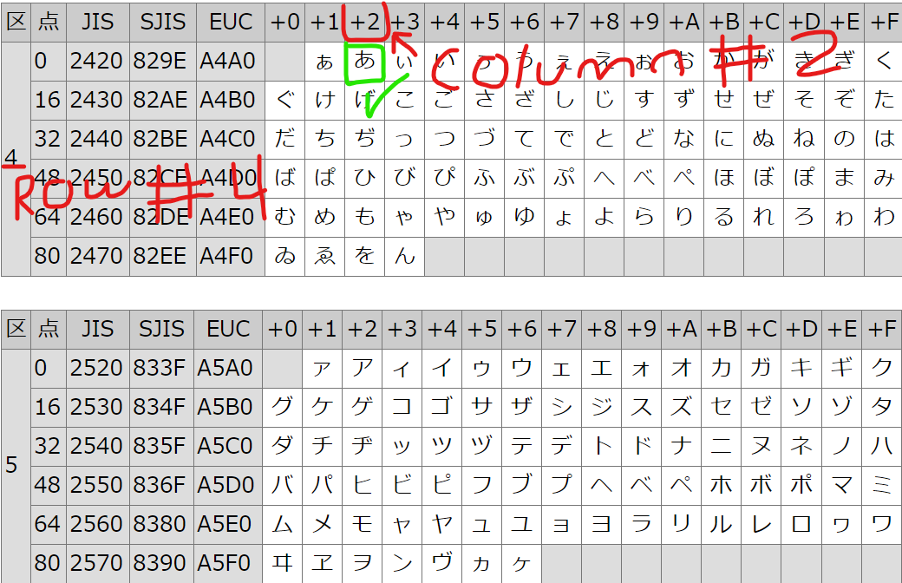

# Encoding & Conversions

## JIS X 0201 to Unicode

Simply add the hexadecimal value 0xFEC0 to the JIS x 0201 code to obtain the corresponding Unicode value.

## JIS X 0208 to Unicode

Use [this conversion map](https://github.com/washboat/Japanese-Syllabary-Recognition/blob/master/Util/JIS_X_0208.py) to convert between JIS X 0208 and Unicode. JIS codes are read into the program in decimal form, so convert the JIS code to hex before using the map.

## KuTen \(区点\)

The KuTen code is a row and column index for characters in the JIS character standard. "Ku" \(区\) refers to the row and "ten" \(点\) refers to the column in which the character resides. For instance, the hiragana character 'あ' \(pronounced like 'ah' has a KuTen code of 0402, indicating that it resides in the fourth row and second column of the table. Below is a snippet of the table

Converting from JIS X 0208 code to KuTen code is as simple as subtracting the hex value '0x2020' from the JIS hex value. the leading byte will be the row, and the trailing byte is the column. The image below demonstrates this conversion using Python 3.

